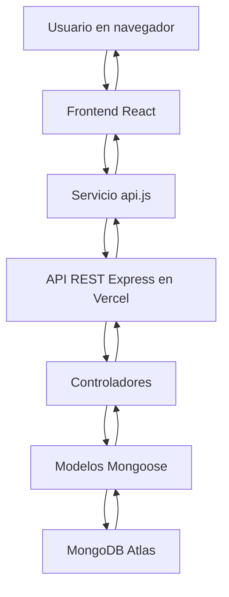

# PEC 4 · Frontend React Geinomi

Frontend desarrollado con React para el proyecto **Geinomi**, una tienda online de mochilas, bolsas y productos de montaña. La aplicación consume la API REST creada en la PEC 3 y obtiene los datos reales desde MongoDB Atlas a través del backend desplegado en Vercel.

## Objetivo

Construir una interfaz React conectada a la API REST de la PEC 3. Desde la interfaz se puede:

- Listar productos mediante una petición `GET`.
- Ver el detalle de un producto.
- Crear productos mediante una petición `POST`.
- Editar productos mediante una petición `PUT`.
- Eliminar productos mediante una petición `DELETE`.
- Gestionar estados de carga, error y éxito.

## Tecnologías utilizadas

- React
- Vite
- JavaScript
- CSS
- Fetch API
- MongoDB Atlas mediante API REST
- Vercel

## Estructura del proyecto

```txt
PEC4_Geinomi_React_Frontend/
├── public/
│   └── geinomi-logo.svg
├── src/
│   ├── components/
│   │   ├── Alert.jsx
│   │   ├── Footer.jsx
│   │   ├── Header.jsx
│   │   ├── Loading.jsx
│   │   ├── ProductCard.jsx
│   │   ├── ProductDetail.jsx
│   │   └── ProductForm.jsx
│   ├── pages/
│   │   └── Home.jsx
│   ├── services/
│   │   └── api.js
│   ├── styles/
│   │   └── global.css
│   ├── App.jsx
│   └── main.jsx
├── .env.example
├── .gitignore
├── index.html
├── package.json
└── README.md
```

## Variable de entorno

Crear un archivo `.env` en la raíz del proyecto con:

```env
VITE_API_URL=https://pec3-geinomi-api-rest.vercel.app
```

No se debe subir el archivo `.env` real a GitHub. Se entrega solo `.env.example`.

## Instalación y ejecución local

```bash
npm install
npm run dev
```

Luego abrir en el navegador la URL que indique Vite, normalmente:

```txt
http://localhost:5173
```

## API utilizada

API desplegada en Vercel:

```txt
https://pec3-geinomi-api-rest.vercel.app
```

Endpoint principal usado por el frontend:

```txt
GET https://pec3-geinomi-api-rest.vercel.app/api/products
```

## Endpoints consumidos

| Método | Ruta | Uso en React |
|---|---|---|
| GET | `/api/products` | Listar productos |
| GET | `/api/products/:id` | Consultar un producto concreto |
| POST | `/api/products` | Crear un nuevo producto |
| PUT | `/api/products/:id` | Editar un producto existente |
| DELETE | `/api/products/:id` | Eliminar un producto |

## Diagrama Mermaid



## Cumplimiento de requisitos de la PEC 4

- Aplicación creada con React.
- Conexión funcional con la API de la PEC 3.
- Listado dinámico de productos mediante `GET`.
- Formulario controlado para crear productos mediante `POST`.
- Uso de `useState` y `useEffect`.
- Estados de carga, éxito y error gestionados.
- Componentes reutilizables y separados.
- URL de la API gestionada con variable de entorno.
- Archivo `.env.example` incluido.
- README con explicación, instalación, endpoints y diagrama Mermaid.
